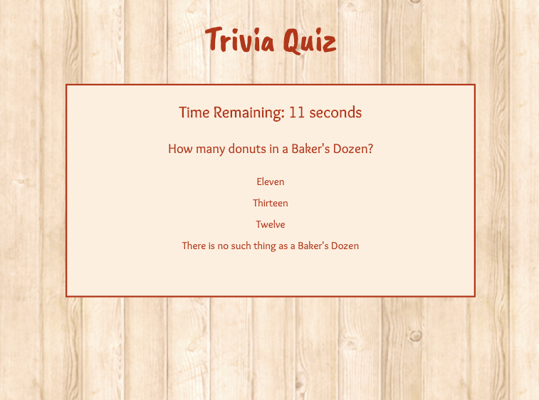
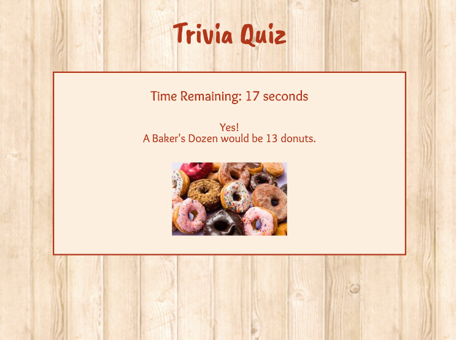

## Trivia Game

https://mbmedhurst.github.io/TriviaGame/

### Description
You have 20 seconds to answer each question in this multiple choice trivia game. 

Everything in this app happens on a single html page.

### Technologies Used
- HTML
- CSS
- JavaScript - this assignment was meant to practice **_setTimeout()_** and **_clearTimeout()_**

### To Run on Local Machine
* clone git repository
* open in browser

### Screenshots

#### Question Page

#### Answer Page
